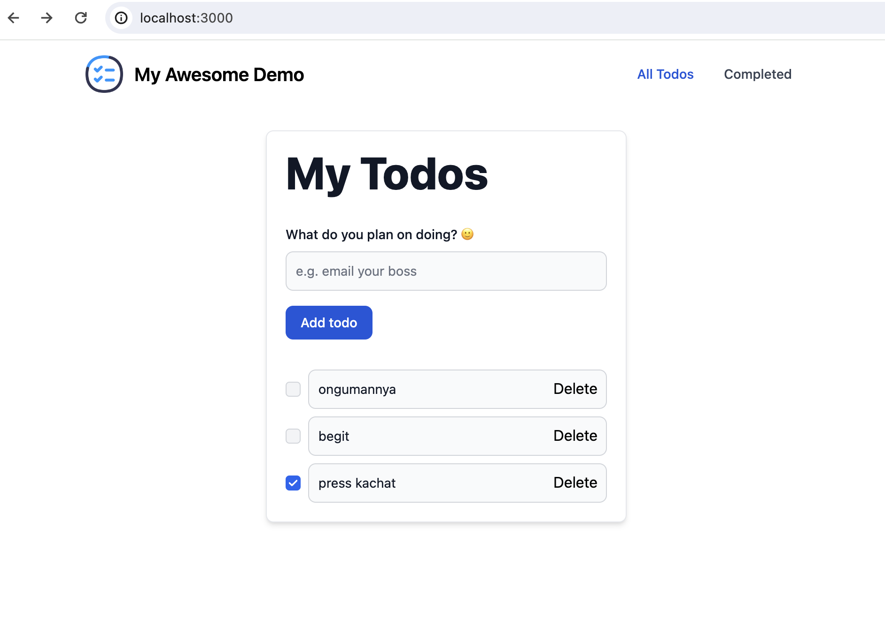

# tr-docker-workshop-demo

## database

```bash
docker compose up -d
```

## backend

```bash
cd backend
make build
make run
```

- Open [localhost:4000](http://localhost:4000)

### Troubleshooting

- On the macOS with Docker Desktop `--network host` [will not work properly](https://stackoverflow.com/a/73683405)
- So, instead of `docker run --network host`, use `docker run -p 4000:4000` for the backend
- To [access the database](https://stackoverflow.com/a/43541732) in the backend container, use `host.docker.internal:5432` instead of `localhost:5432`
- Check out required changes: [`fix: macos --network host issue`](https://github.com/Drapegnik/tr-docker-workshop-demo/commit/66c37bead961939486925f40d5649cd3371f9ae6)

## frontend

```bash
cd frontend
make build
make run
```

- Open [localhost:3000](http://localhost:3000/), you should see the following UI:


